# IC Memo Production Workflow — LLM Capability Map

### Company-Side Fundraising Memo — Blueprint v2.0

> **100+ action steps** · **7 stages** · **5 validation gates** · **18 content sections**
> Every step classified by what an LLM can and cannot do.

---

## LLM Capability Legend

| Color | Meaning | Description |
|:---:|---|---|
| 🔴 | **LLM Cannot Do** | Requires human judgment, proprietary data access, legal authority, or physical sign-off |
| 🟡 | **LLM Needs Human Assistance** | LLM can draft/compute but needs human to supply data, validate, or approve output |
| 🟢 | **LLM Can Do** | LLM can execute independently given prior context and data from earlier steps |

---

## Pre-Production: Transaction Intake

> *Mostly 🔴 — these are executive decisions that set the parameters for everything downstream.*

## Pre-Production: Ownership & Scoping Decisions

> *Mostly 🔴 — personnel assignments and deal structure decisions are human-only.*

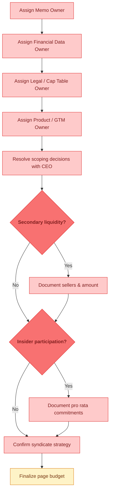

---

## 🚧 Gate 1: Metrics Definition Lock

> *🟡 LLM can propose standard definitions, but Finance must confirm methodology and sign off (🔴).*

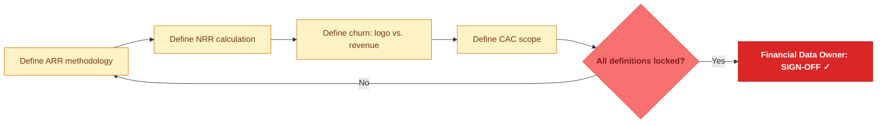

---

## Stage 1: The Hook — Company Overview

> *Mixed — LLM can draft narrative (🟡) but legal docs and cap table are human-sourced (🔴). Compilation is 🟢.*

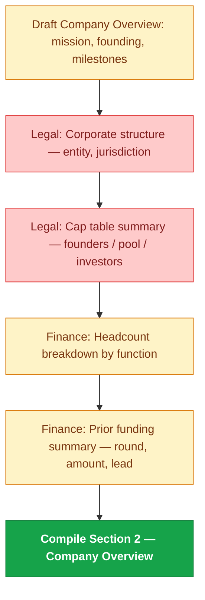

---

## Stage 2: The Opportunity

> *Heavy 🟢 — market research, TAM modeling, competitive framing are LLM strengths. Customer validation (NPS, quotes) is 🔴.*

```mermaid
flowchart TB
  subgraph MKT["Section 3 · Market Opportunity"]
    direction TB
    M1["TAM: top-down from industry reports"]:::grn --> M2["TAM: bottom-up from customers × ACV"]:::yel
    M2 --> M3["Reconcile top-down & bottom-up"]:::grn
    M3 --> M4["Define SAM & SOM"]:::grn
    M4 --> M5["Document 2–4 market tailwinds"]:::grn
    M5 --> M6["Address regulatory landscape"]:::grn
    M6 --> M7["Compile Section 3"]:::grnC
  end
  subgraph PROB["Section 4 · Problem & Solution"]
    direction TB
    P1["Quantify customer pain in $ / hours"]:::yel --> P2["Document current alternatives"]:::grn
    P2 --> P3["Present core solution mechanism"]:::yel
    P3 --> P4["Customer validation: NPS, quotes"]:::red
    P4 --> P5["Compile Section 4"]:::grnC
  end
  subgraph BIZ["Section 5 · Business Model"]
    direction TB
    B1["Revenue model: pricing, billing"]:::yel --> B2["Unit economics: LTV, CAC, payback"]:::yel
    B2 --> B3["Gross margin profile & trend"]:::yel
    B3 --> B4["Expansion revenue mechanics"]:::yel
    B4 --> B5["Compile Section 5"]:::grnC
  end
  MKT --> PROB --> BIZ
  classDef red fill:#fecaca,stroke:#dc2626,color:#7f1d1d
  classDef yel fill:#fef3c7,stroke:#d97706,color:#78350f
  classDef grn fill:#dcfce7,stroke:#16a34a,color:#14532d
  classDef grnC fill:#16a34a,stroke:#15803d,color:#fff,font-weight:700
```

---

## Stage 3: The Proof

> *Mixed — LLM computes growth rates and builds frameworks (🟢), but raw CRM/pipeline data needs human extraction (🟡). Win/loss data is 🔴.*

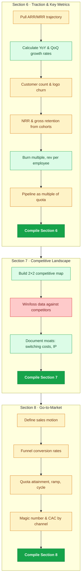

---

## Stage 4: The Team

> *🟡 throughout — LLM can draft profiles from bios, but actual retention data (🔴) and follow-on commitments (🔴) are proprietary.*

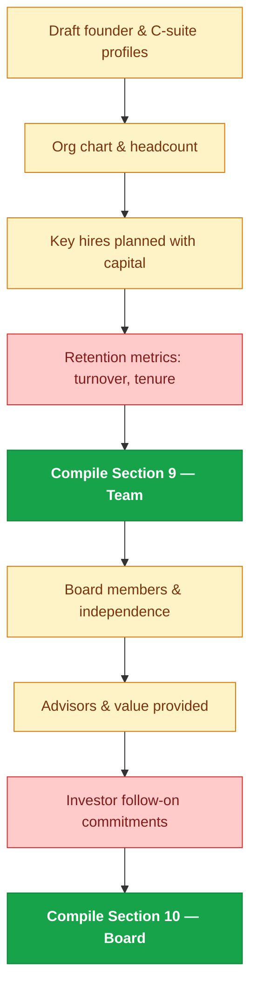

---

## 🚧 Gate 2: Financial Reconciliation

> *GL reconciliation is 🔴 (requires system access). Cross-checking consistency is 🟡. Sign-off always 🔴.*

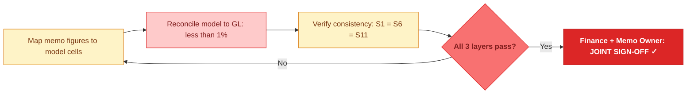

---

## Stage 5: The Numbers

> *🟡 for formatting historicals (needs data fed in). 🟢 for scenario modeling, revenue bridges, runway math once assumptions are set.*

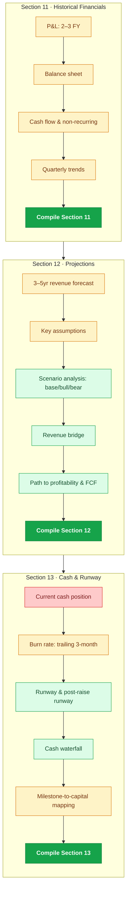

---

## 🚧 Gate 3: Cap Table & Legal Reconciliation

> *Almost entirely 🔴 — cap table verification, legal obligations, and counsel sign-off are human-only. Pro forma math is 🟡.*

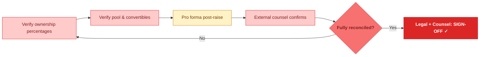

---

## Stage 6: The Ask

> *Section 14 (raise terms) is mostly 🔴 — deal terms are CEO decisions. Section 15 (valuation) is mostly 🟢 — comp analysis, DCF, and triangulation are LLM core strengths. Internal pricing (floor/target/ceiling) is 🔴.*

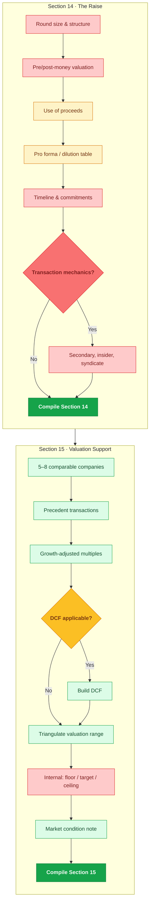

---

## Stage 7: Risk & Close

> *Risk identification and framing is fully 🟢. Milestones need human input (🟡) because they're forward commitments. Appendix index is 🟢.*

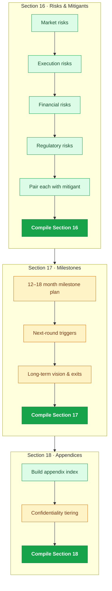

---

## ⭐ Executive Summary — Written Last

> *Fully 🟢 — once all sections are finalized, the LLM can synthesize the exec summary independently.*

---

## 🚧 Gate 4: Appendix Completeness

> *Claim review is 🟢. Customer/screenshot verification is 🔴 (requires access to live systems). Sign-off always 🔴.*

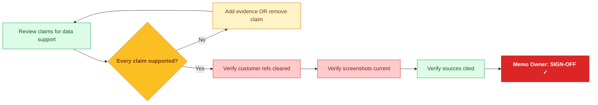

---

## ✅ Decision & Approval Block — Section 19

> *Mostly 🔴 — these are executive/board-level decisions. LLM can draft fallback scenarios (🟡) and compile (🟢).*

---

## 🚧 Gate 5: Final Sign-Off & Pre-Submission QC

> *QC checks are a mix: consistency checks 🟢, data freshness 🟡, NDA/legal clearance 🔴. All sign-offs are 🔴.*

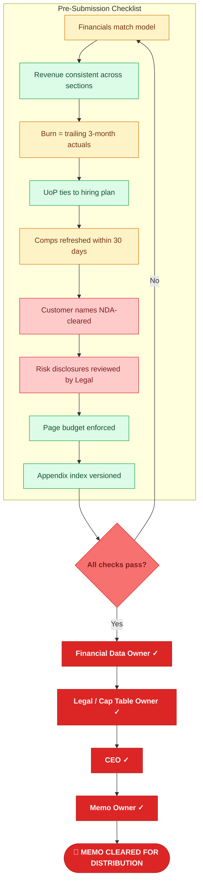

---

## Capability Summary

| Category | Approx. Steps | Examples |
|---|:---:|---|
| 🔴 **LLM Cannot Do** | ~55 | Sign-offs, personnel assignments, deal terms, GL reconciliation, NDA clearance, cap table verification, CEO/board decisions |
| 🟡 **LLM Needs Human Assistance** | ~60 | Draft narratives from data, compute metrics from fed inputs, propose definitions, format financials, build projections from assumptions |
| 🟢 **LLM Can Do** | ~49 | Market research & TAM, comp analysis, scenario modeling, risk frameworks, revenue bridges, section compilation, exec summary, consistency checks |

---

## Usage

**GitHub** — Push this `README.md` for native Mermaid rendering with capability colors.

**Interactive** — Paste charts at [mermaid.live](https://mermaid.live)

**Presentation** — Open `ic_memo_workflow_presentation.html` for the dark-mode scroll-animated version.

---

*IC Production Blueprint v2.0 · LLM Capability Map · Confidential*
