# IC Memo Production Workflow — LLM Capability Map

### Generalized Investment Committee Memo — Blueprint v3.1

> **184 actionable steps** · **7 stages** · **5 validation gates** · **1 decision-rights freeze** · **19 content sections**
> Asset-class agnostic: venture, growth equity, PE, credit, real assets.
> Every step classified by what an LLM can and cannot do.
> v3.1 adds: process controls, sign-off semantics, change control, assumption governance, valuation method applicability.

---

## LLM Capability Legend

| Color | Meaning | Description |
|:---:|---|---|
| 🔴 | **LLM Cannot Do** | Requires human judgment, proprietary data access, legal authority, or physical sign-off |
| 🟡 | **LLM Needs Human Assistance** | LLM can draft/compute but needs human to supply data, validate, or approve output |
| 🟢 | **LLM Can Do** | LLM can execute independently given prior context and data from earlier steps |

## Sign-Off Types (New in v3.1)

| Type | Meaning | Who |
|---|---|---|
| **ATTESTATION** | Domain data is accurate and reconciled | Finance, Legal, Commercial owners |
| **CERTIFICATION** | Memo is production-ready, consistent, all gates passed | Memo Owner |
| **APPROVAL** | Investment recommendation, terms, and strategy endorsed | Deal Sponsor |
| **PREREQUISITE** | Governance/policy requirement fulfilled | Board Chair, External Counsel |

---

## Pre-Production: Transaction Intake

> *Mostly 🔴 — these are Deal Sponsor decisions that set every downstream parameter.*

## Pre-Production: Ownership & Scoping Decisions

> *Mostly 🔴 — personnel assignments and deal structure decisions are human-only. v3.1: Memo Owner is the single accountable owner; version control established at scoping.*

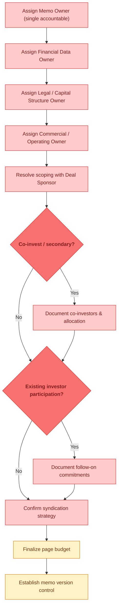

---

## 🚧 Gate 1: Key Metric Definitions & Measurement Policy Lock

> *🟡 LLM can propose standard definitions, but Finance must confirm methodology. v3.1: Renamed for asset-class neutrality; includes metric framework selection by asset class.*

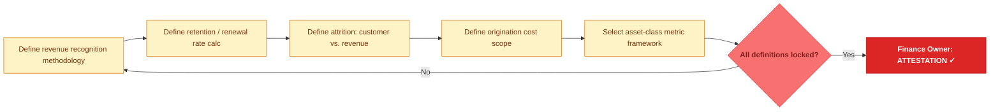

---

## Stage 1: The Hook — Company / Asset Overview

> *Mixed — LLM can draft narrative (🟡) but legal docs and capital structure are human-sourced (🔴). Compilation is 🟢.*

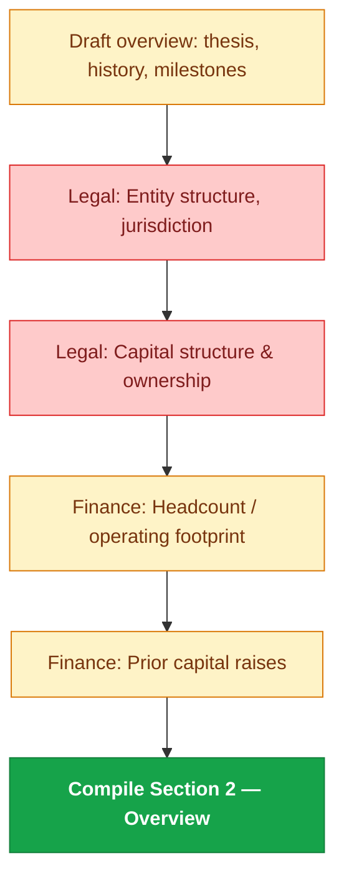

---

## Stage 2: The Opportunity

> *Heavy 🟢 — market research, TAM modeling, competitive framing are LLM strengths. Customer/counterparty validation is 🔴.*

```mermaid
flowchart TB
  subgraph MKT["Section 3 · Market Opportunity"]
    direction TB
    M1["TAM: top-down from industry data"]:::grn --> M2["TAM: bottom-up from addressable accounts"]:::yel
    M2 --> M3["Reconcile top-down & bottom-up"]:::grn
    M3 --> M4["Define SAM & SOM"]:::grn
    M4 --> M5["Document 2–4 sector tailwinds"]:::grn
    M5 --> M6["Regulatory & macro landscape"]:::grn
    M6 --> M7["Compile Section 3"]:::grnC
  end
  subgraph PROB["Section 4 · Value Proposition"]
    direction TB
    P1["Quantify target pain / unmet need"]:::yel --> P2["Document current alternatives"]:::grn
    P2 --> P3["Present core value delivery mechanism"]:::yel
    P3 --> P4["Customer / counterparty validation"]:::red
    P4 --> P5["Compile Section 4"]:::grnC
  end
  subgraph BIZ["Section 5 · Business Model"]
    direction TB
    B1["Revenue model: streams, pricing, contracts"]:::yel --> B2["Unit economics: margins, payback, ROI"]:::yel
    B2 --> B3["Gross / contribution margin profile"]:::yel
    B3 --> B4["Revenue growth levers"]:::yel
    B4 --> B5["Compile Section 5"]:::grnC
  end
  MKT --> PROB --> BIZ
  classDef red fill:#fecaca,stroke:#dc2626,color:#7f1d1d
  classDef yel fill:#fef3c7,stroke:#d97706,color:#78350f
  classDef grn fill:#dcfce7,stroke:#16a34a,color:#14532d
  classDef grnC fill:#16a34a,stroke:#15803d,color:#fff,font-weight:700
```

---

## Stage 3: The Proof

> *Mixed — LLM computes growth rates and builds frameworks (🟢), but raw operating data needs human extraction (🟡). Win/loss data is 🔴.*

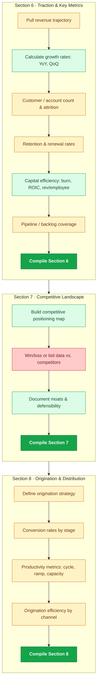

---

## Stage 4: The Team

> *🟡 throughout — LLM can draft profiles, but retention data (🔴) and investor commitments (🔴) are proprietary.*

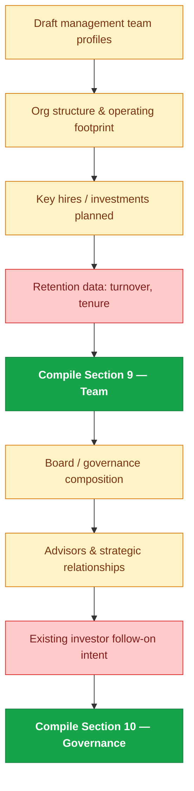

---

## 🚧 Gate 2: Financial Reconciliation & Controls

> *v3.1: Expanded with 4 mandatory finance controls — rounding policy, variance tolerance by line item, single source of truth, and non-GAAP reconciliation.*

```mermaid
flowchart LR
  A["Map figures to model cells"]:::yel --> B["Reconcile to audited actuals"]:::red
  B --> C["Verify consistency across sections"]:::yel
  C --> R["Apply rounding policy"]:::yel
  R --> V["Check variance tolerance by line item"]:::yel
  V --> S["Confirm single source of truth model"]:::red
  S --> N["Reconcile non-GAAP / adjusted metrics"]:::yel
  N --> D{"All layers pass?"}:::redD
  D -- No --> A
  D -- Yes --> E["Finance Owner: ATTESTATION ✓ | Memo Owner: CERTIFICATION ✓"]:::redM
  classDef red fill:#fecaca,stroke:#dc2626,color:#7f1d1d
  classDef yel fill:#fef3c7,stroke:#d97706,color:#78350f
  classDef redD fill:#f87171,stroke:#dc2626,color:#7f1d1d,font-weight:700
  classDef redM fill:#dc2626,stroke:#b91c1c,color:#fff,font-weight:700
```

---

## Stage 5: The Numbers

> *🟡 for formatting historicals (needs data fed in). 🟢 for scenario modeling once assumptions are set. v3.1: Governed assumptions with owner + date + plan tie-out required.*

```mermaid
flowchart TB
  subgraph HIST["Section 11 · Historical Financials"]
    direction TB
    H1["P&L: 2–3 fiscal years"]:::yel --> H2["Balance sheet & working capital"]:::yel
    H2 --> H3["Cash flow & non-recurring items"]:::yel
    H3 --> H4["Quarterly / seasonal trends"]:::yel
    H4 --> H5["Compile Section 11"]:::grnC
  end
  subgraph PROJ["Section 12 · Projections"]
    direction TB
    F1["3–5 year financial forecast"]:::yel --> F2["Governed assumptions: owner + date + source"]:::yel
    F2 --> F3["Scenarios: base / bull / bear (by drivers)"]:::grn
    F3 --> F4["Revenue bridge or growth decomposition"]:::grn
    F4 --> F5["Path to profitability / target returns"]:::grn
    F5 --> FT["Tie assumptions to operating / hiring / capex plan"]:::yel
    FT --> F6["Compile Section 12"]:::grnC
  end
  subgraph CASH["Section 13 · Liquidity & Capital Needs"]
    direction TB
    R1["Current cash / available liquidity"]:::red --> R2["Cash consumption or debt service"]:::yel
    R2 --> R3["Runway, covenant headroom, or coverage"]:::grn
    R3 --> R4["Sources & uses waterfall"]:::grn
    R4 --> R5["Capital allocation plan"]:::yel
    R5 --> R6["Compile Section 13"]:::grnC
  end
  HIST --> PROJ --> CASH
  classDef red fill:#fecaca,stroke:#dc2626,color:#7f1d1d
  classDef yel fill:#fef3c7,stroke:#d97706,color:#78350f
  classDef grn fill:#dcfce7,stroke:#16a34a,color:#14532d
  classDef grnC fill:#16a34a,stroke:#15803d,color:#fff,font-weight:700
```

---

## 🚧 Gate 3: Capital Structure & Legal Reconciliation

> *Almost entirely 🔴 — ownership, obligations, and counsel sign-off are human-only. Pro forma math is 🟡.*

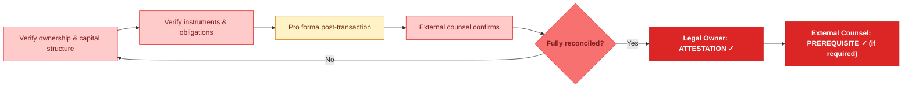

---

## ⚠ Decision-Rights Freeze — Required Before The Ask

> *New in v3.1 — entirely 🔴. Before drafting Sections 14–15, the Deal Sponsor must lock five decision parameters. This prevents late-stage rewrites and internal inconsistency between the ask and the analysis.*

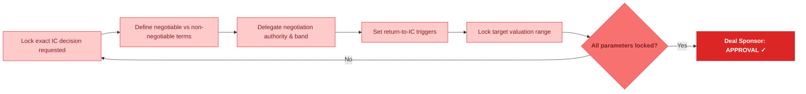

---

## Stage 6: The Ask

> *Section 14 (deal terms) is mostly 🔴. Section 15 (valuation) is mostly 🟢. v3.1: Adds valuation method applicability check — not all methods apply to every deal.*

```mermaid
flowchart TB
  subgraph RAISE["Section 14 · Transaction Terms"]
    direction TB
    R1["Transaction size & structure"]:::red --> R2["Valuation basis: EV, pre/post, asset-level"]:::red
    R2 --> R3["Use of proceeds / capital deployment"]:::yel
    R3 --> R4["Pro forma ownership / leverage impact"]:::yel
    R4 --> R5["Timeline & existing commitments"]:::red
    R5 --> R6{"Complex transaction mechanics?"}:::redD
    R6 -- Yes --> R7["Co-invest, secondary, syndication detail"]:::red
    R6 -- No --> R8["Compile Section 14"]:::grnC
    R7 --> R8
  end
  subgraph VAL["Section 15 · Valuation Support"]
    direction TB
    VX{"Select applicable valuation methods"}:::yelD --> V1["Comparable companies (if comps exist)"]:::grn
    V1 --> V2["Precedent transactions (if recent)"]:::grn
    V2 --> V3["Multiple analysis: EV/Rev, EV/EBITDA, P/E"]:::grn
    V3 --> V4{"DCF / LBO / Cap Rate applicable?"}:::yelD
    V4 -- Yes --> V5["Build applicable model"]:::grn
    V4 -- No --> V6["Triangulate range from available methods"]:::grn
    V5 --> V6
    V6 --> V7["Internal: floor / target / ceiling"]:::red
    V7 --> V8["Market conditions & comp refresh date"]:::grn
    V8 --> V9["Compile Section 15"]:::grnC
  end
  RAISE --> VAL
  classDef red fill:#fecaca,stroke:#dc2626,color:#7f1d1d
  classDef redD fill:#f87171,stroke:#dc2626,color:#7f1d1d,font-weight:700
  classDef yel fill:#fef3c7,stroke:#d97706,color:#78350f
  classDef yelD fill:#fbbf24,stroke:#d97706,color:#78350f,font-weight:700
  classDef grn fill:#dcfce7,stroke:#16a34a,color:#14532d
  classDef grnC fill:#16a34a,stroke:#15803d,color:#fff,font-weight:700
```

---

## Stage 7: Risk & Close

> *Risk identification is fully 🟢. Value creation plan needs human input (🟡). Appendix index is 🟢.*

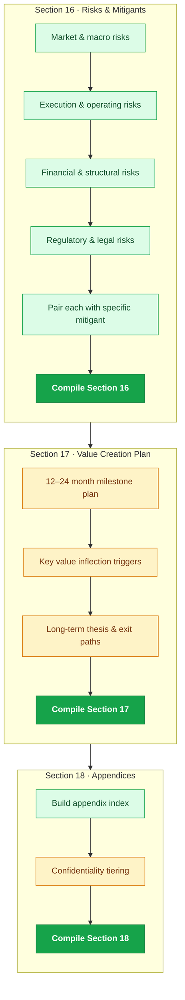

---

## ⭐ Executive Summary — Written Last

> *Fully 🟢 — once all sections are finalized, the LLM can synthesize the exec summary independently.*

---

## 🚧 Gate 4: Appendix Completeness

> *Claim review is 🟢. Reference and exhibit verification is 🔴. v3.1: Memo Owner signs as CERTIFICATION (production readiness).*

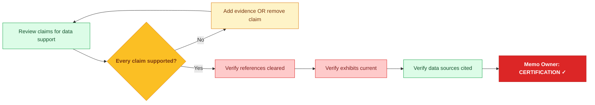

---

## ✅ Decision & Approval Block — Section 19

> *Mostly 🔴 — IC-level decisions. v3.1: Adds internal-only content flagging step before compilation.*

---

## 🚧 Gate 5: Final Sign-Off & Pre-Submission QC

> *v3.1: Expanded with non-GAAP verification, internal-only redaction check, memo version metadata check. Sign-offs now carry explicit types.*

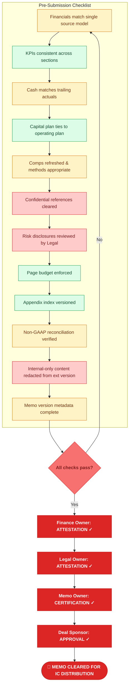

---

## Capability Summary

| Category | Approx. Steps | Examples |
|---|:---:|---|
| 🔴 **LLM Cannot Do** | ~62 | Sign-offs, personnel assignments, deal terms, actuals reconciliation, confidentiality clearance, capital structure verification, decision-rights freeze, IC decisions |
| 🟡 **LLM Needs Human Assistance** | ~66 | Draft narratives from data, compute metrics from inputs, propose KPI definitions, format financials, governed assumptions, build projections, rounding/variance checks |
| 🟢 **LLM Can Do** | ~56 | Market research & TAM, comp analysis, scenario modeling, risk frameworks, revenue bridges, DCF/LBO, section compilation, exec summary, consistency checks |

---

## v3.1 Process Controls Summary

| Control | Description |
|---|---|
| **Ownership Hierarchy** | Memo Owner = single accountable; Deal Sponsor = final approver; functional owners = domain attestation |
| **Sign-Off Semantics** | Four defined types: Attestation, Certification, Approval, Prerequisite |
| **Version Control** | Memo-level: version number, date, owner, change summary, status |
| **Change Control** | Gate re-open rules for 6 trigger events; material changes require new version + re-attestation |
| **Decision-Rights Freeze** | 5 parameters locked before The Ask: decision, negotiables, authority, triggers, valuation range |
| **Finance Controls** | Rounding policy, variance tolerance by line item, single source of truth, non-GAAP reconciliation |
| **Assumption Governance** | Every projection assumption requires: owner, source, date, and plan tie-out |
| **Valuation Applicability** | Method must be justified by asset class and data availability; inappropriate methods flagged |
| **Distribution Controls** | Internal-only content redacted from external versions; -EXT suffix; Deal Sponsor approves external version |

---

## Usage

**GitHub** — Push this `README.md` for native Mermaid rendering with capability colors.

**Interactive** — Paste charts at [mermaid.live](https://mermaid.live)

**Presentation** — Open `index.html` (or `ic_memo_workflow_presentation.html`) for the dark-mode scroll-animated version.

---

*IC Production Blueprint v3.1 · Generalized · Process Controls · LLM Capability Map · Confidential*
