# IC Memo Production Workflow — LLM Capability Map

### Generalized Investment Committee Memo — Blueprint v2.0

> **164 actionable steps** · **7 stages** · **5 validation gates** · **19 content sections**
> Asset-class agnostic: venture, growth equity, PE, credit, real assets.
> Every step classified by what an LLM can and cannot do.

---

## LLM Capability Legend

| Color | Meaning | Description |
|:---:|---|---|
| 🔴 | **LLM Cannot Do** | Requires human judgment, proprietary data access, legal authority, or physical sign-off |
| 🟡 | **LLM Needs Human Assistance** | LLM can draft/compute but needs human to supply data, validate, or approve output |
| 🟢 | **LLM Can Do** | LLM can execute independently given prior context and data from earlier steps |

---

## Pre-Production: Transaction Intake

> *Mostly 🔴 — these are deal sponsor decisions that set every downstream parameter.*

## Pre-Production: Ownership & Scoping Decisions

> *Mostly 🔴 — personnel assignments and deal structure decisions are human-only.*

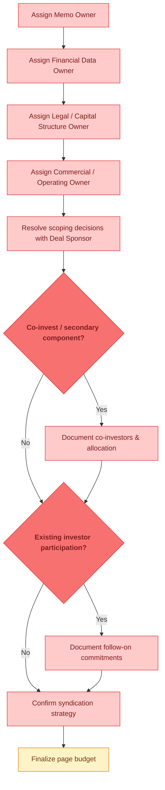

---

## 🚧 Gate 1: KPI & Metrics Definition Lock

> *🟡 LLM can propose standard definitions, but Finance must confirm methodology and sign off (🔴).*

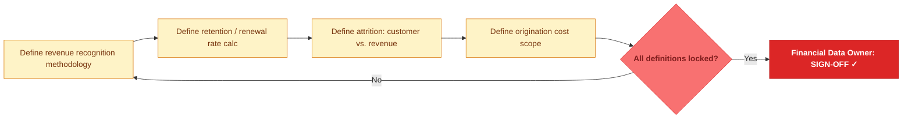

---

## Stage 1: The Hook — Company / Asset Overview

> *Mixed — LLM can draft narrative (🟡) but legal docs and capital structure are human-sourced (🔴). Compilation is 🟢.*

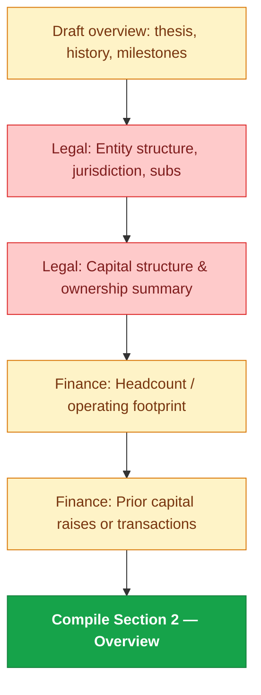

---

## Stage 2: The Opportunity

> *Heavy 🟢 — market research, TAM modeling, competitive framing are LLM strengths. Customer/counterparty validation is 🔴.*

```mermaid
flowchart TB
  subgraph MKT["Section 3 · Market Opportunity"]
    direction TB
    M1["TAM: top-down from industry data"]:::grn --> M2["TAM: bottom-up from addressable accounts"]:::yel
    M2 --> M3["Reconcile top-down & bottom-up"]:::grn
    M3 --> M4["Define SAM & SOM"]:::grn
    M4 --> M5["Document 2–4 sector tailwinds"]:::grn
    M5 --> M6["Regulatory & macro landscape"]:::grn
    M6 --> M7["Compile Section 3"]:::grnC
  end
  subgraph PROB["Section 4 · Value Proposition"]
    direction TB
    P1["Quantify target pain / unmet need"]:::yel --> P2["Document current alternatives"]:::grn
    P2 --> P3["Present core value delivery mechanism"]:::yel
    P3 --> P4["Customer / counterparty validation"]:::red
    P4 --> P5["Compile Section 4"]:::grnC
  end
  subgraph BIZ["Section 5 · Business Model"]
    direction TB
    B1["Revenue model: streams, pricing, contracts"]:::yel --> B2["Unit economics: margins, payback, ROI"]:::yel
    B2 --> B3["Gross / contribution margin profile"]:::yel
    B3 --> B4["Revenue growth levers"]:::yel
    B4 --> B5["Compile Section 5"]:::grnC
  end
  MKT --> PROB --> BIZ
  classDef red fill:#fecaca,stroke:#dc2626,color:#7f1d1d
  classDef yel fill:#fef3c7,stroke:#d97706,color:#78350f
  classDef grn fill:#dcfce7,stroke:#16a34a,color:#14532d
  classDef grnC fill:#16a34a,stroke:#15803d,color:#fff,font-weight:700
```

---

## Stage 3: The Proof

> *Mixed — LLM computes growth rates and builds frameworks (🟢), but raw operating data needs human extraction (🟡). Win/loss data is 🔴.*

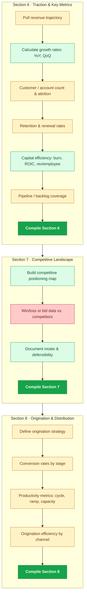

---

## Stage 4: The Team

> *🟡 throughout — LLM can draft profiles, but retention data (🔴) and investor commitments (🔴) are proprietary.*

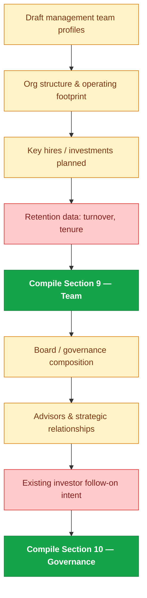

---

## 🚧 Gate 2: Financial Reconciliation

> *Reconciliation to audited actuals is 🔴. Cross-checking consistency is 🟡. Sign-off always 🔴.*

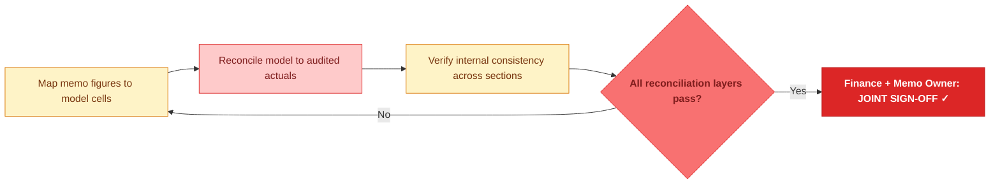

---

## Stage 5: The Numbers

> *🟡 for formatting historicals (needs data fed in). 🟢 for scenario modeling, bridges, and return analysis once assumptions are set.*

```mermaid
flowchart TB
  subgraph HIST["Section 11 · Historical Financials"]
    direction TB
    H1["P&L: 2–3 fiscal years"]:::yel --> H2["Balance sheet & working capital"]:::yel
    H2 --> H3["Cash flow & non-recurring items"]:::yel
    H3 --> H4["Quarterly / seasonal trends"]:::yel
    H4 --> H5["Compile Section 11"]:::grnC
  end
  subgraph PROJ["Section 12 · Projections"]
    direction TB
    F1["3–5 year financial forecast"]:::yel --> F2["Key assumptions documented"]:::yel
    F2 --> F3["Scenario analysis: base / bull / bear"]:::grn
    F3 --> F4["Revenue bridge or growth decomposition"]:::grn
    F4 --> F5["Path to profitability / target returns"]:::grn
    F5 --> F6["Compile Section 12"]:::grnC
  end
  subgraph CASH["Section 13 · Liquidity & Capital Needs"]
    direction TB
    R1["Current cash / available liquidity"]:::red --> R2["Cash consumption or debt service"]:::yel
    R2 --> R3["Runway, covenant headroom, or coverage"]:::grn
    R3 --> R4["Sources & uses waterfall"]:::grn
    R4 --> R5["Capital allocation plan"]:::yel
    R5 --> R6["Compile Section 13"]:::grnC
  end
  HIST --> PROJ --> CASH
  classDef red fill:#fecaca,stroke:#dc2626,color:#7f1d1d
  classDef yel fill:#fef3c7,stroke:#d97706,color:#78350f
  classDef grn fill:#dcfce7,stroke:#16a34a,color:#14532d
  classDef grnC fill:#16a34a,stroke:#15803d,color:#fff,font-weight:700
```

---

## 🚧 Gate 3: Capital Structure & Legal Reconciliation

> *Almost entirely 🔴 — ownership, obligations, and counsel sign-off are human-only. Pro forma math is 🟡.*

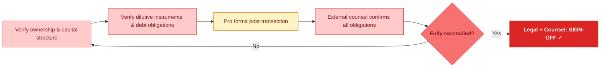

---

## Stage 6: The Ask

> *Section 14 (deal terms) is mostly 🔴. Section 15 (valuation) is mostly 🟢 — comp analysis, DCF/LBO, and triangulation are LLM strengths. Internal pricing is 🔴.*

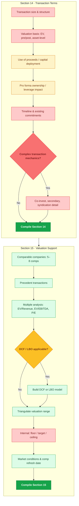

---

## Stage 7: Risk & Close

> *Risk identification is fully 🟢. Value creation plan needs human input (🟡) because it reflects forward commitments. Appendix index is 🟢.*

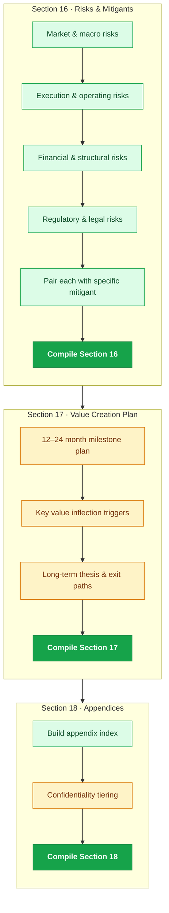

---

## ⭐ Executive Summary — Written Last

> *Fully 🟢 — once all sections are finalized, the LLM can synthesize the exec summary independently.*

---

## 🚧 Gate 4: Appendix Completeness

> *Claim review is 🟢. Reference and exhibit verification is 🔴 (requires live system access). Sign-off always 🔴.*

---

## ✅ Decision & Approval Block — Section 19

> *Mostly 🔴 — IC-level decisions. LLM can draft fallback analysis (🟡) and compile (🟢).*

---

## 🚧 Gate 5: Final Sign-Off & Pre-Submission QC

> *QC checks are a mix: consistency checks 🟢, data freshness 🟡, legal clearance 🔴. All sign-offs are 🔴.*

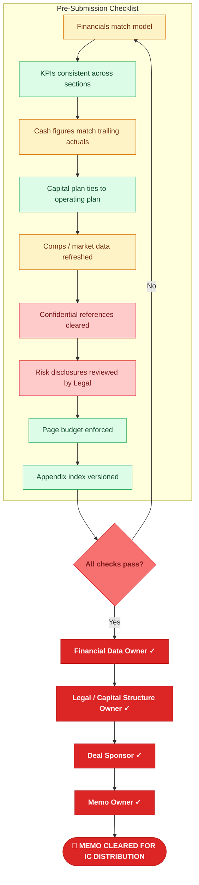

---

## Capability Summary

| Category | Approx. Steps | Examples |
|---|:---:|---|
| 🔴 **LLM Cannot Do** | ~55 | Sign-offs, personnel assignments, deal terms, actuals reconciliation, confidentiality clearance, capital structure verification, IC decisions |
| 🟡 **LLM Needs Human Assistance** | ~60 | Draft narratives from data, compute metrics from fed inputs, propose KPI definitions, format financials, build projections from assumptions |
| 🟢 **LLM Can Do** | ~49 | Market research & TAM, comp analysis, scenario modeling, risk frameworks, revenue bridges, DCF/LBO, section compilation, exec summary, consistency checks |

---

*IC Production Blueprint v3.0 · Generalized · LLM Capability Map · Confidential*
